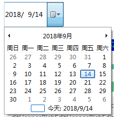
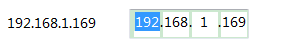
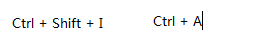

##Duilib扩展插件收集

##### 1、UIElipsePhoto
圆形头像

##### 2、UITimeButton
倒计时按钮

##### 3、UIColorPalette
取色板，调色板
[Frok From](https://github.com/xiaonaiquan/duilib_xiaonaiquan/blob/master/Control/UIColorPalette.cpp)

##### 4、UIFadeButton
渐变按钮

##### 5、UIDateTime
时间选择控件
[Frok From](https://github.com/xiaonaiquan/duilib_xiaonaiquan/blob/master/Control/UIDateTime.cpp)

##### 6、UIIPAddress
IP地址显示
[Frok From](https://github.com/xiaonaiquan/duilib_xiaonaiquan/blob/master/Control/UIIPAddress.cpp)

##### 7、UIChildLayout
CContainerUI的派生类，实行从xml加载控件
[Frok From](https://github.com/xiaonaiquan/duilib_xiaonaiquan/blob/master/Layout/UIChildLayout.cpp)

##### 8、CTrayIcon
托盘图标封装
[Frok From](https://github.com/xiaonaiquan/duilib_xiaonaiquan/blob/master/Utils/TrayIcon.cpp)

##### 9、UIHotKey
捕获键盘快捷键
[Frok From](https://github.com/xiaonaiquan/duilib_xiaonaiquan/blob/master/Control/UIHotKey.cpp)

